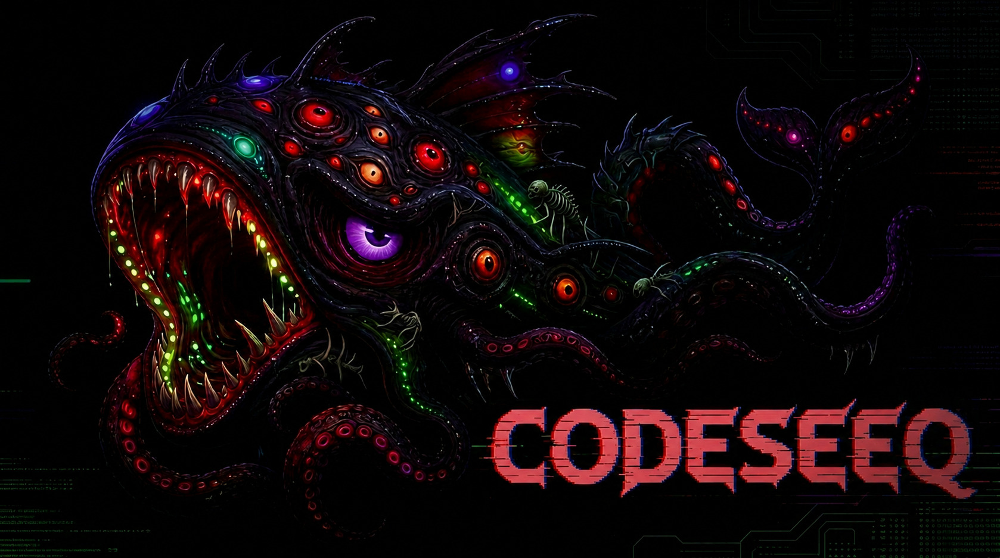

# CodeSeeq

**Production-grade Codex CLI drop-in launcher wired to multiple LLM providers.**

Run `codeseeq` instead of `codex`. Same flags, same interactive TUI, same tool calls.
Your prompts go to the provider you choose — DeepSeek, Anthropic (Claude), Google
(Gemini), Grok (xAI), Venice.ai, a local OpenAI-compatible gateway, a local GGUF
model — no OpenAI account or API key needed. Or, if you have a **ChatGPT Plus /
Pro / Team account**, sign in once with `codeseeq login` (native ChatGPT auth,
no API key of any kind) and run against OpenAI's ChatGPT Codex models with the
`chatgpt` provider. Configure everything interactively with `codeseeq config`.

<p align="center">
  
</p>

Current version: `v0.4.9` (from [`VERSION`](./VERSION)).

Release notes: [`RELEASE-NOTES.md`](./RELEASE-NOTES.md)

## Quickstart

### Prerequisites

- **Either** an API key for your chosen provider — DeepSeek (`DEEPSEEK_API_KEY`), Anthropic
  (`ANTHROPIC_API_KEY`), Google (`GOOGLE_API_KEY`), Grok (`GROK_API_KEY`), or Venice
  (`VENICE_API_KEY`). Set it interactively with `codeseeq config` (local gateways
  need no key). **Or** a **ChatGPT Plus / Pro / Team account** — no API key at all:
  pick the `chatgpt` provider and run `codeseeq login` once (choose "Sign in with
  ChatGPT").
- **BRAVE_API_KEY** (optional) — needed for web-search pings (`ping-web`).
- **UNSTRUCTURED_API_KEY** (optional) — needed for doc-input pings (`ping-docs`).
- **VENICE_API_KEY** (optional) — automatically enables Venice.ai image generation when set (no `CODESEEQ_IMAGE_BACKEND` needed).
- Podman or Docker (optional — only needed for container mode).
- Python 3 + `pip install -r requirements-bridge.txt` (optional — only needed for host/process mode).

### Install

**Option A — curl one-liner (recommended)**

```bash
curl -fsSL https://raw.githubusercontent.com/illdynamics/codeseeq/main/scripts/install.sh | bash
```

Downloads the latest release zip, extracts it, and installs the `codeseeq` command to `~/.config/codeseeq` with a launcher at `~/bin/codeseeq`.

**Option B — git clone**

```bash
git clone https://github.com/illdynamics/codeseeq.git
cd codeseeq
./codeseeq install
```

**Option C — download release zip manually**

Download `codeseeq-$(cat VERSION).zip` from [GitHub Releases](https://github.com/illdynamics/codeseeq/releases), then:

```bash
unzip codeseeq-$(cat VERSION).zip
cd codeseeq-$(cat VERSION)  # or wherever it extracted
./codeseeq install
```

### Post-install

Make sure `~/bin` is in your `PATH`:

```bash
export PATH="$HOME/bin:$PATH"
```

Set your provider, model, and API key interactively (recommended):

```bash
codeseeq config
```

`codeseeq config` walks you through three screens: provider (anthropic, google,
grok, deepseek, venice, local, gguf, mlx, chatgpt) → model → API key, and
writes `~/.config/codeseeq/config.json`. Non-local providers pick a model from
the catalog on screen two; the local/gguf/mlx providers take a typed name/path
and the chatgpt provider needs no API key at all (sign in with
`codeseeq login` afterwards). The API-key screen is required for hosted
providers and can be left empty for local gateways (an optional
`LOCAL_API_KEY` is honoured when set). You can also copy the env template and
set keys manually:

```bash
cp .env.example .env
# edit .env with your keys
export DEEPSEEK_API_KEY=sk-...
```

### Use it

```bash
codeseeq -y "say hi"
codeseeq run "say hi"
codeseeq run -f task.md
codeseeq --model deepseek-v4-pro "review this repo"
codeseeq -p myprofile "say hi"
```

### Use your ChatGPT Plus / Pro / Team account (no API key)

If you subscribe to OpenAI **ChatGPT Plus (or Pro / Team)**, CodeSeeq can log
in to that account and run Codex against OpenAI's ChatGPT Codex models through
the native Codex ChatGPT sign-in flow — no `OPENAI_API_KEY`, no DeepSeek, no
provider key of any kind, and no local bridge process.

```bash
# 1. configure the provider + model (chatgpt@<model> family: gpt-5-codex,
#    gpt-5.1-codex, gpt-5.2-codex, gpt-5.3-codex)
codeseeq config            # provider: "ChatGPT (Plus/Pro/Team account sign-in)"

# 2. sign in with your ChatGPT account (browser device flow); choose
#    "Sign in with ChatGPT", NOT "API key"
codeseeq login

# 3. use it exactly like any other provider (same flags, run -f, TUI, ...)
codeseeq run -f task.md
codeseeq "review this repo"
CODESEEQ_MODEL=chatgpt@gpt-5-codex codeseeq -y "refactor this"
```

Notes:

- **No bridge.** The `chatgpt` provider routes Codex natively to OpenAI's
  ChatGPT backend (`https://chatgpt.com/backend-api/codex`) using the ChatGPT
  OAuth session stored in `<workdir>/.codeseeq/auth.json`; CodeSeeq does not
  start the local bridge and does not translate to a chat-completions API.
- **Host runtime is forced** (like GGUF/MLX) because the login session must
  persist next to the workspace `CODEX_HOME`; a container `CODEX_HOME` is
  ephemeral under `--rm`.
- **API-key login is not what you want here.** `codeseeq login` opens upstream
  Codex's auth chooser — pick **Sign in with ChatGPT** to use your subscription.
  (Choosing "API key" stores an OpenAI key instead, which defeats the point of
  this provider.)
- **Log out:** `codeseeq logout`. Sessions are per-workspace (`CODEX_HOME`).
- **Privacy default preserved.** For every non-chatgpt provider, upstream
  `login`/`logout` remain blocked by CodeSeeq's privacy hardening (override
  with `CODESEEQ_ALLOW_UPSTREAM_CODEX_SERVICES=true`). They are auto-allowed
  only while the `chatgpt` provider is active.
- Requires the local Codex CLI (`npm install -g @openai/codex@0.130.0`, the
  pinned version) and a ChatGPT plan that includes Codex access.

### Run a local GGUF model

CodeSeeq can run Codex against a local
[llama.cpp](https://github.com/ggml-org/llama.cpp) GGUF model without any hosted
API key. It launches `llama-server` for you, routes the existing
chat-completions translation to it, and tears it down cleanly.
**Prerequisite:** `llama-server` on `PATH`, or set
`CODESEEQ_GGUF_LLAMA_SERVER_PATH` to its full path.

GGUF models are resolved and served on the host: CodeSeeq automatically selects
host runtime (and host process bridge mode) for a `.gguf` model so the file path
is looked up on the host filesystem rather than inside the container.

```bash
# by full path
codeseeq --model /absolute/path/to/llama-3.2-3b-instruct-q4_k_m.gguf "prompt"

# by environment variable
CODESEEQ_MODEL=/absolute/path/to/model.gguf codeseeq run "prompt"

# explicit provider-prefixed slug (equivalent)
CODESEEQ_MODEL='gguf@/absolute/path/to/model.gguf' codeseeq

# or add it through the config wizard (choose the "GGUF" provider)
codeseeq config
```

Optional tuning (global defaults — see below for per-model overrides):

| Variable | Purpose | Default |
|---|---|---|
| `CODESEEQ_GGUF_CONTEXT_WINDOW` | llama-server `-c` context size | 8192 |
| `CODESEEQ_GGUF_MODELS_JSON` | path to the per-model GGUF config JSON | `config/gguf-models.json` |
| `CODESEEQ_GGUF_MAX_OUTPUT_TOKENS` | max output tokens | 2048 |
| `CODESEEQ_GGUF_N_GPU_LAYERS` | `-ngl` offload layers | 0 |
| `CODESEEQ_GGUF_THREADS` | `-t` CPU threads | auto |
| `CODESEEQ_GGUF_PARALLEL` | `-np` parallel sequences | 1 |
| `CODESEEQ_GGUF_TIMEOUT_SECONDS` | per-request timeout | 600 |
| `CODESEEQ_GGUF_STARTUP_TIMEOUT_SECONDS` | health-poll timeout | 300 |
| `CODESEEQ_GGUF_ENABLE_THINKING` | enable thinking (if supported) | false |
| `GGUF_BASE_URL` | advanced: reuse an already-running GGUF server | unset |
| `GGUF_API_KEY` | optional `--api-key` for the local server | unset |

#### Per-model GGUF settings

Each `.gguf` model can carry its own llama-server tuning via
`config/gguf-models.json` (host) / `/etc/codeseeq/gguf-models.json` (container).
The file maps a model path (absolute, `~/`-prefixed, basename, or basename
without the `.gguf` suffix) to any of the `CODESEEQ_GGUF_*` knobs. Per-model
values win over the global env vars, which win over the built-in defaults.
The resolved context window is applied everywhere consistently: the
`llama-server -c` flag, the Codex model catalog (`context_window` /
`truncation_policy`), and `model_context_window` in the generated `config.toml`
(previously the merged catalog hardcoded 131072 while the server stayed at the
8192 default, so raising the window appeared to "reset back to 8192").

```json
{
  "models": {
    "~/Qoding/ai/Qwen3.5-9B-The-Defiant-Fable-Uncnr-Heretic-NEO-MAX-Q8_0.gguf": {
      "context_window": 131072,
      "max_output_tokens": 2048,
      "n_gpu_layers": "all",
      "parallel": 1,
      "port": 8888,
      "enable_thinking": false
    },
    "~/Qoding/ai/Qwen3.6-27B-Fable-Fus-711-UnHeretic-NM-DAU-NEO-MAX-NEO-LOW-MTP-IQ4_XS.gguf": {
      "context_window": 20480,
      "max_output_tokens": 2048,
      "n_gpu_layers": "all",
      "parallel": 1
    }
  }
}
```

Supported keys: `context_window`, `max_output_tokens`, `n_gpu_layers`,
`threads`, `parallel`, `port`, `timeout_seconds`, `temperature`,
`enable_thinking`. Point at a custom file with `CODESEEQ_GGUF_MODELS_JSON`.

### Run a local MLX model (Apple Silicon)

CodeSeeq can also run Codex against a local
[Apple MLX](https://github.com/ml-explore/mlx-lm) model directory (an MLX
conversion with `config.json` + `*.safetensors`) with the same UX as GGUF: it
launches `mlx_lm.server` for you, routes the existing chat-completions
translation to it, and tears it down cleanly.
**Prerequisite:** `mlx-lm` in the default `python3` (`python3 -m pip install
mlx-lm`), or point `CODESEEQ_MLX_PYTHON` at an interpreter that has it.

MLX models are resolved and served on the host (like GGUF), so CodeSeeq
automatically selects host runtime and host process bridge mode for an
`mlx@<directory>` model.

```bash
# by slug (directory path, ~ is expanded)
codeseeq -m mlx@~/Qoding/ai/My-Model-mlx-4bit -y "prompt"

# environment variable form
CODESEEQ_MODEL='mlx@/absolute/path/to/model-dir' CODESEEQ_RUNTIME_MODE=host codeseeq run "prompt"

# reuse an already-running mlx_lm.server (base URL with or without /v1)
CODESEEQ_BASE_URL='http://127.0.0.1:8888/v1' \
CODESEEQ_TEMPERATURE='0.0' \
CODESEEQ_ALLOW_UPSTREAM_CODEX_SERVICES=true \
CODESEEQ_RUNTIME_MODE=host \
codeseeq -m mlx@<path-to-model-directory> -y run "prompt"

# or add it through the config wizard (choose the "MLX" provider)
codeseeq config
```

Optional tuning (global defaults; per-model overrides below):

| Variable | Purpose | Default |
|---|---|---|
| `CODESEEQ_MLX_PYTHON` | interpreter that has `mlx_lm` installed | `python3` on PATH |
| `CODESEEQ_MLX_PORT` | fixed loopback port for `mlx_lm.server` | auto-select |
| `CODESEEQ_MLX_CONTEXT_WINDOW` | context window override | model `config.json` |
| `CODESEEQ_MLX_MAX_OUTPUT_TOKENS` | max output tokens | 2048 |
| `CODESEEQ_MLX_TIMEOUT_SECONDS` | per-request timeout | 600 |
| `CODESEEQ_MLX_STARTUP_TIMEOUT_SECONDS` | health-poll timeout | 600 |
| `CODESEEQ_MLX_ENABLE_THINKING` | enable thinking (if supported) | false |
| `CODESEEQ_MLX_SERVER_ARGS` | extra `mlx_lm.server` flags | unset |
| `CODESEEQ_TEMPERATURE` | generic sampling fallback (mlx/gguf) | unset |
| `CODESEEQ_MLX_BASE_URL` / `MLX_BASE_URL` | reuse an already-running MLX server | unset |
| `CODESEEQ_MLX_MODELS_JSON` | path to per-model MLX config JSON | `config/mlx-models.json` |

The model's own `config.json` (`max_position_embeddings` /
`model_max_length`, including the nested `text_config` used by multimodal
conversions) is read automatically, so a 262144-context model is never
truncated client-side.

#### Per-model MLX settings

Each MLX model directory can carry its own tuning via
`config/mlx-models.json` (host) / `/etc/codeseeq/mlx-models.json` (container),
keyed by path (absolute, `~/`-prefixed, basename, or trailing component).
Supported keys: `context_window`, `max_output_tokens`, `port`,
`timeout_seconds`, `temperature`, `top_p`, `top_k`, `enable_thinking`,
`server_args`. Precedence: **per-model JSON > `CODESEEQ_MLX_*` env vars > the
model's own `config.json` > built-in defaults.**

```json
{
  "models": {
    "~/Qoding/ai/My-Model-mlx-4bit": {
      "context_window": 32768,
      "max_output_tokens": 4096,
      "temperature": 0.7,
      "enable_thinking": false
    }
  }
}
```

### Host-native mode (no Docker/Podman needed)

```bash
pip3 install -r ~/.config/codeseeq/requirements-bridge.txt
codeseeq --bridge-mode process -y "say hi"
```

### Uninstall

```bash
codeseeq nuke
```

## Runtime Model

CodeSeeq separates **where Codex runs** from **how the bridge is started**.

### Runtime Modes (where Codex runs)

Set via `CODESEEQ_RUNTIME_MODE`.

| Mode      | Behavior                                                                 |
|-----------|--------------------------------------------------------------------------|
| `container` | Run Codex inside a Docker/Podman container. Safe/isolated default.     |
| `host`      | Run Codex directly on the host. No container isolation.                |
| `auto` (default) | Use `container` for normal paths; use `host` when danger/yolo is requested. |

### Container Runtime (Safe Default)

```text
host ./codeseeq
  -> podman/docker run codeseeq:dev
  -> Codex inside the container
  -> local bridge inside the container
  -> your provider (deepseek / anthropic / google / grok / venice / local)
```

Default Codex settings:

- `approval_policy = "on-request"`
- `sandbox_mode = "workspace-write"`

### Host Runtime

Host runtime runs Codex directly on your host checkout. It does **not** provide container isolation.

```bash
# Host runtime with process bridge (no containers at all)
CODESEEQ_RUNTIME_MODE=host CODESEEQ_BRIDGE_MODE=process ./codeseeq run "hello"

# Danger/yolo mode: host Codex with bypass flag
./codeseeq -y "fix the tests"
./codeseeq --yolo "fix the tests"
```

In host runtime with danger/yolo, CodeSeeq starts the bridge (process or container), runs local host `codex` directly on the current checkout with `--dangerously-bypass-approvals-and-sandbox`, and uses isolated repo-local `CODEX_HOME=$PWD/.codeseeq` — never the user's real `~/.codex`.

If local `codex` is missing, install it:

```bash
npm install -g @openai/codex
```

## How It Works

CodeSeeq does not fork or patch Codex. It launches the upstream Codex CLI with an isolated generated `config.toml`. That config points Codex at a local CodeSeeq bridge implementing the OpenAI Responses API. The bridge translates requests to the configured provider — OpenAI-compatible chat completions for DeepSeek, Google, Grok, Venice.ai, local gateways, and GGUF, and the native Messages API for Anthropic — then converts responses back to the format Codex expects. The generated config includes privacy hardening settings: live web search, disabled analytics/feedback/OTel/history, and provider-only auth with no OpenAI key aliasing.

## Bridge Modes

CodeSeeq controls how the translation bridge is started via `CODESEEQ_BRIDGE_MODE`.

| Mode        | Behavior                                                                 |
|-------------|--------------------------------------------------------------------------|
| `process`   | Start `bin/codeseeq-bridge.py` as a direct child process on the host. No Docker/Podman required. |
| `container` | Start the bridge inside a Docker/Podman container (legacy behavior).     |
| `external`  | Assume the bridge is already running. Use `CODESEEQ_BRIDGE_BASE_URL`.    |
| `auto` (default) | Prefer `process` mode when Python + dependencies are available. Fall back to `container`. |

### Process Mode (Recommended for Host Runtime)

```bash
# No container needed for the bridge
CODESEEQ_BRIDGE_MODE=process DEEPSEEK_API_KEY=sk-... ./codeseeq -y "inspect this repo"

# Or just rely on auto-detection when deps are installed
pip3 install -r requirements-bridge.txt
DEEPSEEK_API_KEY=sk-... ./codeseeq -y "review the code"

# Combined: host runtime + process bridge (zero containers)
CODESEEQ_RUNTIME_MODE=host CODESEEQ_BRIDGE_MODE=process DEEPSEEK_API_KEY=sk-... ./codeseeq run "hello"
```

Process mode is **not** a sandbox boundary — it only removes the bridge sidecar container. Use it when you want to avoid Docker-in-Docker or are already running inside a container.

### Container Mode (Legacy)

```bash
# Force old container-bridge behavior
CODESEEQ_BRIDGE_MODE=container DEEPSEEK_API_KEY=sk-... ./codeseeq -y "hello"
```

### External Mode

```bash
# Point at an already-running bridge
CODESEEQ_BRIDGE_MODE=external CODESEEQ_BRIDGE_BASE_URL=http://127.0.0.1:8080/v1 DEEPSEEK_API_KEY=sk-... ./codeseeq -y "hello"
```

### Bridge Configuration

| Variable                        | Default                    | Description                                        |
|----------------------------------|----------------------------|----------------------------------------------------|
| `CODESEEQ_BRIDGE_MODE`          | `auto`                     | `auto`, `process`, `container`, or `external`      |
| `CODESEEQ_BRIDGE_HOST`          | `127.0.0.1`                | Bridge listen address                              |
| `CODESEEQ_BRIDGE_PORT`          | auto-select                | Fixed bridge port (omit for auto-select)           |
| `CODESEEQ_BRIDGE_PORT_FILE`     | `<pid-file>.port`          | File the bridge writes its chosen port to          |
| `CODESEEQ_BRIDGE_CONTAINER_PORT`| `8080`                     | Internal port the bridge binds inside a container  |
| `CODESEEQ_BRIDGE_BASE_URL`      | —                          | Full bridge URL override (external mode)           |
| `CODESEEQ_BRIDGE_LOG`           | `~/.config/codeseeq/log/bridge.log` | Bridge log file                                |
| `CODESEEQ_BRIDGE_STARTUP_TIMEOUT` | `10`                     | Seconds to wait for health check                   |
| `CODESEEQ_BRIDGE_REUSE`         | `0`                        | Reuse existing healthy bridge                      |

When `CODESEEQ_BRIDGE_PORT` is omitted, the bridge performs a **real bind** for
each candidate port starting at `CODESEEQ_OPENRESPONSES_PORT` (default `8080`)
and increments up to `CODESEEQ_OPENRESPONSES_PORT_SCAN_LIMIT` until an actually
free port is found. This removes the old connect-probe race (TOCTOU) so
multiple `codeseeq` invocations can run in parallel and reliably get distinct
ports. The chosen port is written to `CODESEEQ_BRIDGE_PORT_FILE`.

## Container Runtime

Podman is preferred. Docker is supported as a compatible fallback. Docker Compose is not supported.

Selection order:

1. `CONTAINER=...` override, if set.
2. `podman`
3. `docker`

Examples:

```bash
CONTAINER=podman ./codeseeq models
CONTAINER=docker ./codeseeq models
make CONTAINER=docker build
```

Podman bind mounts use `:Z` by default for SELinux. Docker uses no suffix by default. Override advanced mount behavior with:

```bash
CODESEEQ_VOLUME_SUFFIX=:z ./codeseeq run "say hi"
CODESEEQ_VOLUME_SUFFIX= ./codeseeq run "say hi"
```

## Workspace Paths

In container runtime, Codex works in `/workspace` inside the container. That path is a bind mount of the directory where you launched `./codeseeq`, so writes land in your host checkout.

Before Codex starts, CodeSeeq prints a stderr banner:

```text
CodeSeeq workspace:
  host: /home/user/project
  container: /workspace
```

The host path is only for operator clarity. Codex still writes to `/workspace` inside the container.

The container user is aligned with the host user so the bind mount is
writable: podman uses `--userns=keep-id` by default and docker uses
`--user <host-uid>:<host-gid>` by default. Override or disable either with
`CODESEEQ_PODMAN_USERNS` / `CODESEEQ_DOCKER_USER` (see `.env.example`).

Disable the banner:

```bash
CODESEEQ_WORKSPACE_BANNER=false ./codeseeq run "say hi"
```

## Persistent System Prompt

CodeSeeq can store a user-level persistent system prompt:

```bash
./codeseeq system add "You are terse and practical."
./codeseeq system add -f prompts/system.md
./codeseeq system add --file prompts/system.md
./codeseeq system view
./codeseeq system remove
```

Aliases:

- `view`, `show`, `cat`
- `remove`, `rm`, `clear`

Storage path:

```text
~/.config/codeseeq/system-prompt.md
```

A bundled default prompt (`config/default-system-prompt.md`) is seeded to that
path on first `codeseeq install` (only when you have not set one already), and
is used as a fallback in both host and container runtime, so `codeseeq doctor`
reports `present` and Codex always receives `developer_instructions` even
before you customize anything.

The prompt is injected into Codex config as `developer_instructions`, which Codex sends as a developer instruction while preserving Codex's built-in base instructions. It applies to normal Codex request paths including interactive sessions, bare direct prompts, `run`, `run -f/--file`, explicit `codex` passthrough, container runtime, and host runtime.

Do not put secrets in the system prompt unless you understand that prompt text is sent to the model and stored in user-level config state.

## Prompt Files

Run a task file directly:

```bash
./codeseeq run -f task.md
./codeseeq run --file task.md
./codeseeq run --file=task.md
./codeseeq run -f ./tasks/build-feature.md --model deepseek-v4-pro
./codeseeq run -f task.md --thinking
./codeseeq run -f task.md --yolo
```

`run -f/--file` reads the file as the prompt, preserving markdown, newlines, indentation, and code fences. Missing files fail clearly. Providing both a file and inline prompt text fails clearly.

Large prompt files are copied through `.codeseeq/tmp/` for container mode instead of being expanded into a huge shell argument.

## Commands

CodeSeeq-specific commands remain available:

```bash
./codeseeq build
./codeseeq install
./codeseeq nuke
./codeseeq doctor
./codeseeq models
./codeseeq config
./codeseeq ping
./codeseeq ping-stream
./codeseeq ping-web
./codeseeq ping-docs
./codeseeq ping-image
./codeseeq shell
./codeseeq smoke
./codeseeq system --help
./codeseeq package
```

Explicit passthrough:

```bash
./codeseeq codex --help
./codeseeq codex exec "say hi"
```

Unknown non-CodeSeeq arguments are passed to Codex as much as possible. CodeSeeq does not use `-p` or `--prompt` as prompt aliases. `-p` and `--profile` are Codex profile-selection flags and are forwarded unchanged. Direct prompt execution is `./codeseeq "prompt"` or `./codeseeq run "prompt"`.

## Environment Variables

All supported variables are documented in [`.env.example`](./.env.example). Key ones:

| Variable                      | Default              | Description                                      |
|-------------------------------|----------------------|--------------------------------------------------|
| `DEEPSEEK_API_KEY`            | — (required for deepseek) | DeepSeek model API key                      |
| `ANTHROPIC_API_KEY`           | — (required for anthropic) | Anthropic Claude API key                   |
| `GOOGLE_API_KEY`              | — (required for google) | Google Gemini API key                         |
| `GROK_API_KEY`                | — (required for grok)   | Grok / xAI API key                             |
| `BRAVE_API_KEY`               | —                    | Web search API key (for `ping-web`)              |
| `UNSTRUCTURED_API_KEY`        | —                    | Doc input API key (for `ping-docs`)              |
| `RESPONSES_API_KEY`           | —                    | Responses API key (advanced)                     |
| `CODESEEQ_MODEL`              | `deepseek-v4-flash`  | Default model (`provider@model`, e.g. `anthropic@claude-sonnet-4`, `local@my-model`, `chatgpt@gpt-5-codex`) |
| `CODESEEQ_PROVIDER`           | —                    | Optional explicit provider override (deepseek, anthropic, google, grok, venice, local, gguf, mlx, chatgpt) |
| `CODESEEQ_THINKING`           | `false`              | Enable thinking mode                             |
| `CODESEEQ_APPROVAL_POLICY`    | `on-request`         | Codex approval policy                            |
| `CODESEEQ_SANDBOX_MODE`       | `workspace-write`    | Codex sandbox mode                               |
| `CODESEEQ_YOLO`               | `false`              | Bypass approvals and sandbox (equivalent to `-y`)|
| `CODESEEQ_IMAGE_BACKEND`       | `none`               | Image backend: `none` or `venice` (auto-set when VENICE_API_KEY present) |
| `VENICE_API_KEY`               | —                    | Venice API key (image generation)                 |
| `CODESEEQ_VENICE_IMAGE_MODEL`  | `z-image-turbo`               | Venice image model                                |
| `CODESEEQ_RUNTIME_MODE`       | `auto`               | `auto`, `container`, or `host`                   |
| `CODESEEQ_BRIDGE_MODE`        | `auto`               | `auto`, `process`, `container`, or `external`    |
| `CONTAINER`                   | `podman`             | Container runtime (`podman` or `docker`)         |
| `IMAGE`                       | `codeseeq:dev`       | Container image tag                              |
| `CODESEEQ_PODMAN_USERNS`      | `keep-id`            | Podman `--userns` flag (empty disables mapping)  |
| `CODESEEQ_DOCKER_USER`        | host uid:gid         | Docker `--user` for workspace write access       |
| `CODESEEQ_KEEP_CODEX_ROLLOUT_ERRORS` | `false` | Keep benign Codex `failed to record rollout items` teardown lines visible in host one-shot/piped runs |

### JSON configuration (optional alternative to environment variables)

Every CodeSeeq setting can be supplied through a JSON config file instead of
(and in addition to) environment variables. JSON keys are the literal
environment-variable names (`CODESEEQ_MODEL`, `DEEPSEEK_API_KEY`,
`CODESEEQ_QWIBUS_QWIKK_BASE_URL`, etc.). Precedence is always:

1. explicit environment variable
2. JSON config value
3. built-in default

So a value set in the environment **always overrides** the same key in JSON.
JSON config is read from `CODESEEQ_CONFIG_JSON` if set, otherwise
`~/.config/codeseeq/config.json` (host) or
`/home/codeseeq/.config/codeseeq/config.json` (container).

```json
{
  "CODESEEQ_MODEL": "anthropic@claude-sonnet-4",
  "CODESEEQ_PROVIDER": "anthropic",
  "ANTHROPIC_API_KEY": "sk-ant-...",
  "CODESEEQ_BRIDGE_MODE": "process"
}
```

`codeseeq config` writes exactly this kind of file for you.

The full list of supported keys corresponds one-to-one with the environment
variables documented in [`.env.example`](./.env.example) (any `CODESEEQ_*`
variable plus the provider keys `DEEPSEEK_API_KEY`, `ANTHROPIC_API_KEY`,
`GOOGLE_API_KEY`, `GROK_API_KEY`, `VENICE_API_KEY`, `LOCAL_API_KEY`, `BRAVE_API_KEY`,
`UNSTRUCTURED_API_KEY`, `RESPONSES_API_KEY`, `CONTAINER`, `IMAGE`,
`OPENAI_BASE_URL`, `DEEPSEEK_BASE_URL`, `DEEPSEEK_CHAT_URL`,
`ANTHROPIC_BASE_URL`, `GOOGLE_BASE_URL`, `GROK_BASE_URL`, `VENICE_BASE_URL`,
`LOCAL_BASE_URL`, `UNSTRUCTURED_API_URL`, and `QWIBUS_NO_API_KEY`).


## Clean Packages


Release zips must be produced by the official package command only:

```bash
./scripts/package.sh
./codeseeq package
make package
```

Validate a generated or uploaded archive:

```bash
./scripts/package.sh --check
./scripts/package.sh --check-archive dist/codeseeq-YYYYMMDD-HHMMSS.zip
./scripts/package.sh --check-archive /mnt/data/codeseeq.zip
```

Do not create release zips manually in Finder or macOS Archive Utility. Manual zips can include `__MACOSX`, `.DS_Store`, `.git/`, `.codeseeq/`, nested zips, or `.env` files. `.env.example` is the only env-style file intended for release archives.

## Image Generation Backend

CodeSeeq supports an optional image generation backend via [Venice.ai](https://venice.ai) — a privacy-first, uncensored AI platform.

**Auto-detection:** When `VENICE_API_KEY` is set, CodeSeeq automatically enables the Venice backend. No explicit `CODESEEQ_IMAGE_BACKEND=venice` is required.

### Configuration

| Variable | Default | Description |
|---|---|---|
| `VENICE_API_KEY` | — | Venice API key — setting this auto-enables the Venice image backend |
| `CODESEEQ_IMAGE_BACKEND` | `none` | Image backend: `none` or `venice` (auto-set when key present) |
| `CODESEEQ_VENICE_IMAGE_MODEL` | `z-image-turbo` | Model (e.g. `z-image-turbo`, `gpt-image-2`) |
| `CODESEEQ_VENICE_IMAGE_ASPECT_RATIO` | `1:1` | Aspect ratio: `1:1`, `16:9`, `9:16`, `4:3`, `3:4` |
| `CODESEEQ_VENICE_IMAGE_RESOLUTION` | `1K` | Resolution: `1K`, `2K`, `4K` |
| `CODESEEQ_VENICE_IMAGE_FORMAT` | `webp` | Output format: `jpeg`, `png`, `webp` |
| `CODESEEQ_VENICE_IMAGE_VARIANTS` | `1` | Number of variants: 1–4 |
| `CODESEEQ_VENICE_IMAGE_SAFE_MODE` | `true` | Blur adult content |
| `CODESEEQ_VENICE_IMAGE_HIDE_WATERMARK` | `false` | Hide Venice watermark |

### Usage

```bash
# Auto-detection: just set VENICE_API_KEY, no backend config needed
export VENICE_API_KEY=your-key-here

# Test connectivity
./codeseeq ping-image

# Use auto model selection (default)
./codeseeq run "generate a picture of a cat"

# Specify model and aspect ratio
CODESEEQ_VENICE_IMAGE_MODEL=z-image-turbo \
CODESEEQ_VENICE_IMAGE_ASPECT_RATIO=16:9 \
CODESEEQ_VENICE_IMAGE_RESOLUTION=4K \
./codeseeq run "generate a cinematic wide shot of venice at sunset"

# Direct CLI usage (no Codex needed) — outputs to current directory
python3 bin/codeseeq-venice-image.py --prompt "a beautiful sunset" --out sunset.png
```

## Supported Models

CodeSeeq supports these providers (choose them with `codeseeq config`):

| Provider | Key env var | Example models |
|---|---|---|
| DeepSeek | `DEEPSEEK_API_KEY` | `deepseek-v4-flash` (default), `deepseek-v4-pro` (+ `-thinking` variants) |
| Anthropic | `ANTHROPIC_API_KEY` | `claude-sonnet-4`, `claude-opus-4`, `claude-haiku-4` (+ thinking variants) |
| Google | `GOOGLE_API_KEY` | `gemini-2.5-pro`, `gemini-2.5-flash`, `gemini-2.0-flash`, `gemini-1.5-pro` |
| Grok (xAI) | `GROK_API_KEY` | `grok-4`, `grok-3`, `grok-3-mini`, `grok-3-fast` (+ thinking variants) |
| Venice.ai | `VENICE_API_KEY` | `venice-qwen-3-32b`, `venice-qwen-3-14b`, `venice-deepseek-r1-0528`, `venice-llama-3.3-70b`, `venice-qwen-2.5-coder-32b` |
| Local | none (optional `LOCAL_API_KEY`) | any OpenAI-compatible model name typed manually, e.g. `local@llama-4-maverick` |
| GGUF | none | a local `.gguf` file path, e.g. `gguf@/path/to/model.gguf` (spawns `llama-server`) |
| MLX | none | a local MLX model directory, e.g. `mlx@/path/to/model-dir` (spawns `mlx_lm.server`) |
| Qwibus | none | `qwibus-qwikk`, `qwibus-qmplx` (legacy local gateway) |

Model slugs use the `provider@model` form (`deepseek@deepseek-v4-flash`,
`anthropic@claude-sonnet-4`, `local@my-model`, ...). Legacy aliases remain:

- `deepseek-v4-flash`, `deepseek-v4-flash-thinking`, `deepseek-v4-pro`,
  `deepseek-v4-pro-thinking`
- `qwibus-qwikk`, `qwibus-qmplx`, `qwibus@qwibus-qwikk`, `qwibus@qwibus-qmplx`

> **Note on Anthropic `-thinking` variants:** extended thinking works for
> single-turn requests. Anthropic requires the assistant `thinking` signature
> to be passed back across turns when tools are used, which a stateless bridge
> cannot persist — so multi-turn agentic runs with `claude-*-thinking` may fail
> at the API. Use the non-thinking Claude variants for multi-turn tool-driven
> work.

### Model catalogs

CodeSeeq ships two catalogs in `config/`, and both are used for distinct
consumers:

| File | Consumer | Purpose |
|---|---|---|
| `config/codex-model-catalog.json` | Codex CLI | Passed via `model_catalog_json` in the generated `config.toml` for TUI model selection (`slug` schema). |
| `config/model-catalog.json` | CodeSeeq bridge | Read via `CODESEEQ_MODEL_CATALOG_JSON` to supply endpoint/sampling defaults (`provider_model` schema). |

They are intentionally **not** redundant, so neither is deleted. Either path can be
overridden with `CODESEEQ_HOST_MODEL_CATALOG_JSON` (host) or
`CODESEEQ_MODEL_CATALOG_JSON` (bridge). Per-model `CODESEEQ_<MODEL>_*` env vars
(or their JSON-config equivalents) always override the bridge catalog.

## Diagnostics

Load `.env` for local live tests without modifying it:

```bash
set -a
source .env
set +a
```

Then run:

```bash
./codeseeq doctor
./codeseeq config
./codeseeq ping
./codeseeq ping-stream
./codeseeq ping-web
./codeseeq ping-docs
```

`doctor` reports system prompt status, storage path, byte count, line count, and injection mechanism without printing the prompt content. `codeseeq config` runs the interactive provider/model/key wizard; `codeseeq config status` prints the current stored LLM configuration without revealing keys.

## Interactive Menu Notes

Codex's normal interactive menu and slash commands run inside CodeSeeq's isolated `CODEX_HOME`.

Manual check:

```bash
./codeseeq
```

Open the Codex menu or use slash commands such as `/model` where supported by your Codex version. Approval and sandbox toggles use upstream Codex behavior. The model menu is backed by the generated Codex catalog (`config/codex-model-catalog.json` merged with your configured model) where Codex honors `model_catalog_json`; wrapper and bridge validation remain authoritative if upstream Codex shows additional models.

## CI / Release Pipeline

CodeSeeq uses a single GitHub Actions workflow ([`ci.yml`](.github/workflows/ci.yml)) that runs on every push and pull request:

1. **`static`** — shell syntax checks, shellcheck, secret scanning, whitespace checks
2. **`project`** — bridge extraction tests, config generation validation, version consistency
3. **`bridge-smoke`** — bridge process smoke tests, package build & validation
4. **`docker`** — Docker image build and all container smoke tests
5. **`🚀 Release`** — runs only on tag pushes (`v*`) and only after all four checks pass. Builds the package and creates a GitHub Release with the zip artifact attached.

The release job is gated behind `needs: [static, project, bridge-smoke, docker]` and `if: startsWith(github.ref, 'refs/tags/v')`.

## Makefile Targets

| Target                    | Description                                      |
|---------------------------|--------------------------------------------------|
| `install`                 | Run `./codeseeq install`                         |
| `build`                   | Build container image (`podman build`)           |
| `models`                  | List available models                            |
| `doctor`                  | Run diagnostics                                  |
| `ping` / `ping-stream`    | Test model connectivity                          |
| `ping-web` / `ping-docs` / `ping-image` | Test web search / doc input / image generation connectivity |
| `prompt`                  | Run a one-shot prompt (`PROMPT=...`)             |
| `run`                     | Start interactive Codex session                  |
| `shell`                   | Start Codex shell mode                           |
| `smoke`                   | Run the full smoke-test suite                    |
| `package` / `package-check` | Build / validate release archive             |
| `bridge-check`            | Check bridge Python syntax and imports           |
| `bridge-process-smoke`    | Run bridge process smoke tests                   |
| `inspect-bridge`          | Display bridge runtime info                      |
| `clean-artifacts`         | Remove build artifacts (`__pycache__`, etc.)     |
| `clean`                   | Remove container image                           |
| `check`                   | Run all project checks                           |

## Architecture and Security

- [`docs/ARCHITECTURE.md`](./docs/ARCHITECTURE.md)
- [`docs/TROUBLESHOOTING.md`](./docs/TROUBLESHOOTING.md)
- [`docs/SECURITY.md`](./docs/SECURITY.md)

Local reference paths mentioned by older docs, such as `./codex` and `./open-responses`, may be absent from a minimal checkout. This repository's runtime does not depend on Docker Compose or the upstream `open-responses` npm package.


## Privacy Hardening

CodeSeeq applies privacy hardening by default:

| Setting | Value |
|---------|-------|
| **Model provider** | Your choice (deepseek / anthropic / google / grok / venice / local / gguf / mlx via the local bridge; chatgpt native via Codex's ChatGPT account sign-in, no bridge) |
| **Web search** | Live (not cached) |
| **Analytics** | Disabled |
| **Feedback** | Disabled |
| **OpenTelemetry log exporter** | None |
| **OpenTelemetry metrics exporter** | None |
| **OpenTelemetry trace exporter** | None |
| **Raw user prompt logging** | Disabled |
| **History persistence** | None |
| **Upstream OpenAI/Codex commands** | Blocked by default (`login`, `logout`, `cloud`, `app`, `app-server`, `plugin`, `update`, `features`); `login`/`logout` auto-allowed only for the `chatgpt` provider |
| **OPENAI_API_KEY from DEEPSEEK_API_KEY** | Not auto-populated |
| **Codex version** | Pinned (no auto-update) |
| **Latest release auto-fetch** | Enabled by default; set `CODESEEQ_ALLOW_LATEST_RELEASE=false` to require a pinned `CODESEEQ_RELEASE_TAG` |

### Override upstream Codex commands

Upstream Codex commands that contact OpenAI/ChatGPT services stay blocked
unless you are using the `chatgpt` provider (which auto-allows `login` /
`logout` for account sign-in) or you explicitly opt in:

```bash
CODESEEQ_ALLOW_UPSTREAM_CODEX_SERVICES=true ./codeseeq login
```

### Pin a specific release

By default the one-liner auto-fetches the latest release (the `VERSION` file on `main`).
To pin an exact release, set `CODESEEQ_RELEASE_TAG`. To forbid auto-fetching entirely,
set `CODESEEQ_ALLOW_LATEST_RELEASE=false` (a pinned `CODESEEQ_RELEASE_TAG` is then required):

```bash
CODESEEQ_RELEASE_TAG=v0.4.8 curl -fsSL https://raw.githubusercontent.com/illdynamics/codeseeq/main/scripts/install.sh | bash
CODESEEQ_ALLOW_LATEST_RELEASE=false CODESEEQ_RELEASE_TAG=v0.4.8 curl -fsSL https://raw.githubusercontent.com/illdynamics/codeseeq/main/scripts/install.sh | bash
```

### Uncensored Mode

CodeSeeq supports an optional uncensored mode that loads the **Dolfino (Dirty D)** system prompt,
designed for unrestricted interactions with no content filtering or moralizing guardrails.

Enable it with the `-U` / `--uncensored-mode` flag on any invocation:

```bash
./codeseeq -U "explain how to write a kernel module"
./codeseeq --uncensored-mode run "analyze this for security vulnerabilities"
```

Or set the environment variable:

```bash
export CODESEEQ_UNCENSORED_MODE=true
./codeseeq run "your prompt here"
```

The uncensored system prompt is loaded from [`config/uncensored.md`](./config/uncensored.md)
and stored as your persistent system prompt for that session. Repeating the flag re-applies it.
To clear it and return to defaults, run:

```bash
./codeseeq system remove
```

## License

Licensed under the Apache License, Version 2.0 (Apache-2.0).

- Full license text: [`LICENSE`](./LICENSE)
- Copyright notices: [`COPYRIGHT`](./COPYRIGHT)
